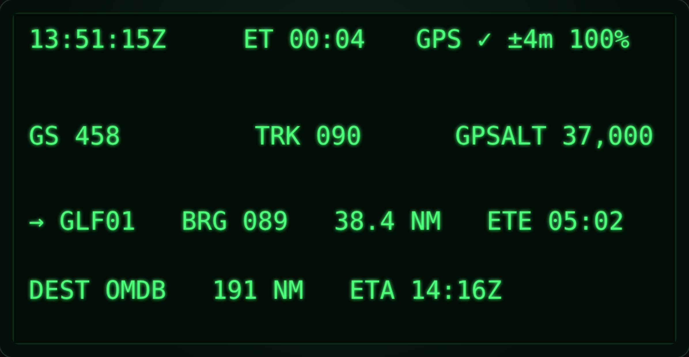
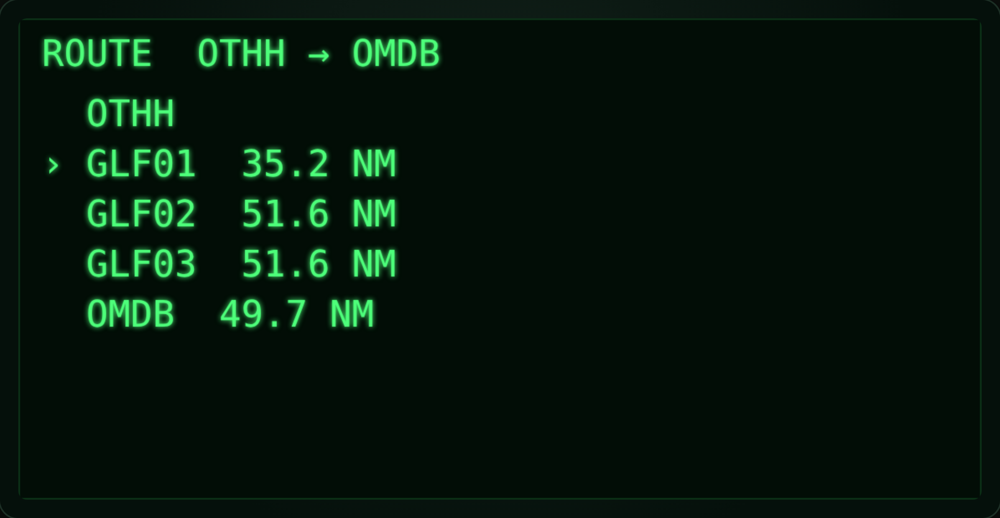
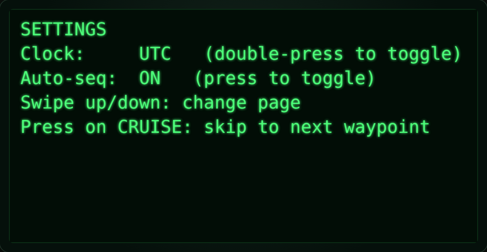

# Aviation HUD for Even Realities G2

A wearable **heads-up situational-awareness display** for the [Even Realities
**G2**](https://hub.evenrealities.com/docs/get-started/overview) smart glasses,
tuned for **airline cruise (A320)** and other **non-critical phases of flight**.
It shows just the right information — at a glance — derived from a **Garmin GLO**
GPS: ground speed, track, GPS altitude, next-waypoint guidance, and a
destination/ETA roll-up on UTC.



> ### ⚠️ Read this first — experimental & supplemental only
>
> This is a **personal, experimental** tool. It is **not** a certified
> instrument, **not** part of any aircraft, and **not** a primary reference.
>
> - **GPS altitude is geometric**, not pressure altitude / flight level. It is
>   labelled `GPSALT` and must never be read as an altimeter or used for level
>   assignment. The aircraft's certified instruments remain the only reference.
> - **GPS reception in an airliner is poor** — the fuselage acts as a Faraday
>   cage. The Garmin GLO needs a window/glareshield placement to hold a fix.
> - **Operator policy & regulations apply.** Using any personal display in a
>   flight deck may be restricted. Comply with your operator's SOPs and the
>   applicable regulations. Never let it distract from flying or monitoring.
> - Do not use in critical phases of flight or in IMC.

---

## The platform, in one paragraph

A G2 "app" is a **web app** loaded into a WebView on the paired iPhone; the
**display and input are relayed over Bluetooth LE** to the glasses. Each lens is
a **576 × 288, 16-level monochrome-green** micro-LED panel. Practical refresh is
low (a few FPS, one send at a time, limited BLE bandwidth), and the SDK renders
**≤ 12 absolutely-positioned containers** (text / list / image) rather than a
DOM — with no font-size control. Those constraints make a **sparse,
slow-changing, high-contrast** data strip the right design, which is exactly
what a glanceable cruise HUD wants. Positioning, IMU, gestures, and device
status come through the SDK's [`EvenAppBridge`](https://hub.evenrealities.com/docs/build/device-apis);
the Garmin GLO feeds `onAppLocationChanged` transparently as an iOS MFi
location source.

## What it shows

**CRUISE** — the primary at-a-glance strip:

| Row | Fields |
| --- | --- |
| Status | UTC (or local) clock · elapsed timer `ET` · `GPS ✓ ±acc battery%` |
| Primary | `GS` ground speed (kt) · `TRK` ground track (°) · `GPSALT` GPS altitude (ft) |
| Active waypoint | `→ IDENT · BRG · DIST (NM) · ETE` |
| Destination | `DEST IDENT · DIST · ETA (UTC)` |

**ROUTE** — the flight plan with the active waypoint marked and leg distances.
**SETTINGS** — clock (UTC/local), auto-sequence, and the gesture legend.

<p align="center">
  
  
</p>

### Controls (temple touchpad or R1 ring)

| Gesture | Action |
| --- | --- |
| Swipe down / up | Next / previous page (CRUISE · ROUTE · SETTINGS) |
| Press | CRUISE: skip to next waypoint · SETTINGS: toggle auto-sequence |
| Double-press | Toggle UTC / local clock |

## Run the simulator (no hardware needed)

```bash
npm install
npm run dev        # opens the in-browser simulator
```

The simulator renders a faithful 576 × 288 monochrome-green display and **flies
a demo route** (`OTHH → OMDB`, Gulf corridor) so every field is live. Drive it
with the keyboard:

| Key | Effect |
| --- | --- |
| `↓` / `↑` | Change page |
| `Enter` / `Space` | Press |
| `D` | Double-press (toggle clock) |
| `[` / `]` | Slow down / speed up the simulated flight |

Other scripts:

```bash
npm test           # nav-math unit tests (geo / time / flight plan / route parser)
npm run typecheck  # TypeScript, incl. the on-device SDK path
npm run build      # typecheck + build the simulator bundle
```

## Architecture

The whole app is written against a small **`GlassesBridge`** seam, so the exact
same controller/renderer runs on real glasses or in the browser simulator.

```
src/
  core/    pure, unit-tested nav math & models (no SDK / DOM)
    geo.ts        great-circle bearing, distance, cross-track, along-track
    units.ts      m/s↔kt, m↔ft, glanceable formatting
    time.ts       UTC clock, ETE, ETA
    flightplan.ts Route + active-leg tracking → Guidance
  data/
    navdata.ts        bundled airports + demo route (illustrative, not for nav)
    route-parser.ts   "OTHH DCT GLF01 … OMDB" → waypoints
    position/         PositionSource: SDK (Garmin GLO) + simulated flight
  bridge/
    bridge.ts     GlassesBridge interface (display + input)
    even-sdk.ts   real bridge over @evenrealities/even_hub_sdk
    sim-bridge.ts canvas bridge emulating the 576×288 green display
  hud/
    model.ts      HudState + views
    views.ts      CRUISE / ROUTE / SETTINGS layouts (fit the ≤12-container budget)
    renderer.ts   diffs frames → minimal no-flicker text updates
  app/controller.ts  state machine: sources → flight plan → renderer + gestures
  main.ts       on-device entry (WebView)
  sim/          browser dev harness (canvas + keyboard)
```

Data flow: **PositionSource** (Garmin GLO / simulated) → **FlightPlan.guidance()**
→ **HudState** → **views** → **HudRenderer** (diff) → **GlassesBridge** → display.

## On-device deployment (roadmap)

The on-device path (`index.html` + `src/main.ts`) is implemented and
type-checked against the real SDK, but running it requires the Even iPhone app,
a paired G2, and a Garmin GLO — it cannot be exercised in this repo's CI. Packaging
and submission to Even Hub (app icon, manifest, `even-publisher`) is a follow-up.

## Roadmap

- Pilot-entered / imported route (SimBrief or filed plan), persisted via the SDK's
  local storage.
- Top-of-Descent and destination ETA refinements; wind estimate from GS/track history.
- Nearest-airport page; cross-track CDI needle.
- IMU "look-down" declutter (dim the HUD when the pilot looks at the panel).
- Larger primary digits via image containers (works around the fixed font).
- Optional Mapbox static-map thumbnail (track-up), updated slowly.

## Notes on the demo data

`src/data/navdata.ts` contains a handful of real airport reference points and a
few **synthetic** enroute fixes (`GLF01–03`) used only by the demo route. It is
**not** a navigation database and must not be used for real navigation.
