# Aviation HUD for Even Realities G2

A wearable **PFD-style heads-up display** for the [Even Realities
**G2**](https://hub.evenrealities.com/docs/get-started/overview) smart glasses,
tuned for **airline cruise (A320)** and other **non-critical phases of flight**.
It follows primary-flight-display convention — **ground speed left, GPS altitude
right, track tape at the bottom** — with a **track-up diversion plan** in the
centre that shows the nearest **suitable alternates by bearing and distance**,
best one highlighted. All data derives from a **Garmin GLO** GPS.

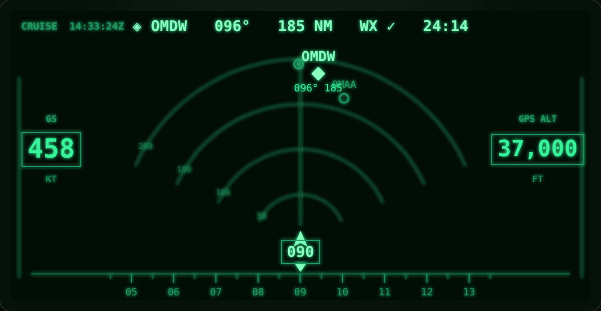

> ### ⚠️ Read this first — experimental & supplemental only
>
> This is a **personal, experimental** tool. It is **not** a certified
> instrument, **not** part of any aircraft, and **not** a primary reference.
>
> - **GPS altitude is geometric**, not pressure altitude / flight level. It is
>   labelled `GPSALT` and must never be read as an altimeter or used for level
>   assignment. The aircraft's certified instruments remain the only reference.
> - **GPS reception in an airliner is poor** — the fuselage acts as a Faraday
>   cage. The Garmin GLO needs a window/glareshield placement to hold a fix.
> - **Operator policy & regulations apply.** Using any personal display in a
>   flight deck may be restricted. Comply with your operator's SOPs and the
>   applicable regulations. Never let it distract from flying or monitoring.
> - Do not use in critical phases of flight or in IMC.

---

## Head-slewed target acquisition (the signature interaction)

Turn your head to look around the world; airports appear **where they actually
are** in azimuth. Park the reticle on one, click the **R1 ring** to lock it, and
its detail card opens — ident, name, bearing, distance, ETE, runway, METAR, and
suitability. An off-screen cue (`◀ OMDW 28°`) points your head toward the nearest
suitable field.

<p align="center">
  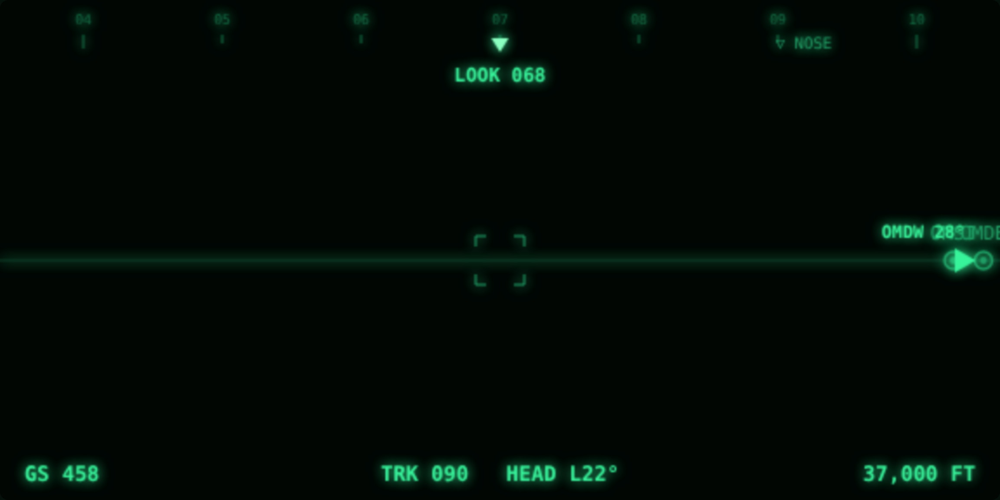
  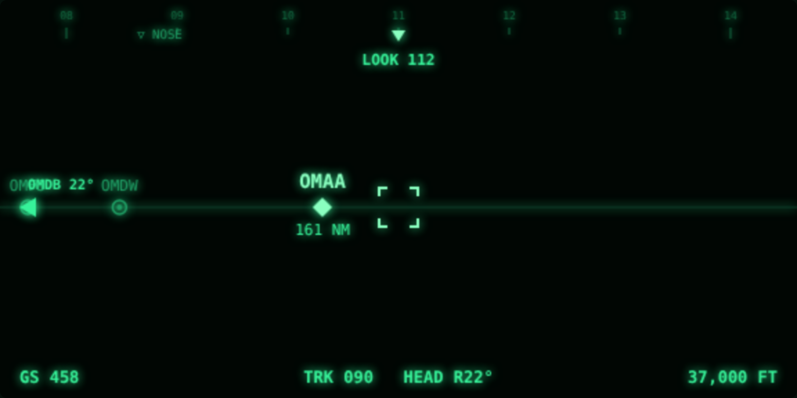
  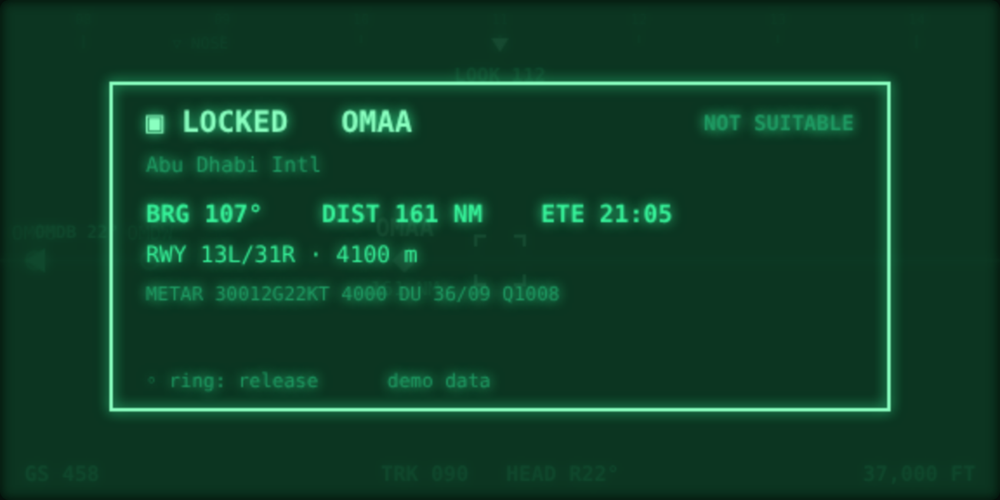
</p>

Why this is feasible where a conformal HUD is not: it needs only head **azimuth
(yaw)** — targets are placed by *bearing minus head direction* — not aircraft
attitude, so it never touches the leans-prone gravity fusion. Honest caveats
baked in:

- **Yaw drifts.** Integrated head-gyro azimuth has no reliable cockpit heading
  reference, so it slowly wanders; the design expects a "look ahead + ring click
  to re-centre" gesture. (In the simulator, head angle is exact.)
- **~10 Hz, BLE-latent.** The G2 IMU reports at ≤10 Hz — this is "look, settle,
  click", not fast flicks.
- Head IMU gives *head* orientation, never aircraft attitude; nothing here is an
  attitude reference.

Try it: `npm run dev`, then move the mouse (= your head), `Enter`/`Space` to lock.
`V` cycles to the PFD and minimal views.

---

## Aircraft attitude from the mounted phone (optional)

The iPhone is mounted on the airframe, so **its IMU is an aircraft attitude
source** — a portable-AHRS, like a Sentry/Levil. That gives *two* gyros: the
**phone → aircraft attitude** and the **glasses → head orientation**. Their
difference is head-relative-to-airframe, which is what makes an approximately
**conformal horizon** possible: it stays pinned to the real world as you bank and
as you tilt your head. Press `A` for the horizon + pitch ladder, `Q`/`E` to tilt
your head and watch it counter-rotate.

<p align="center">
  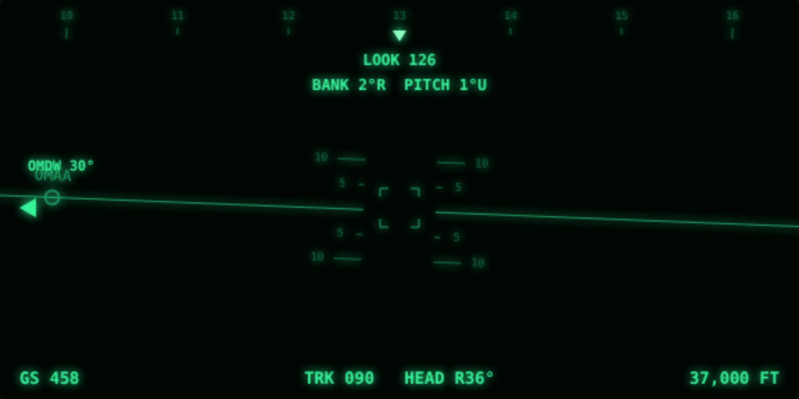
  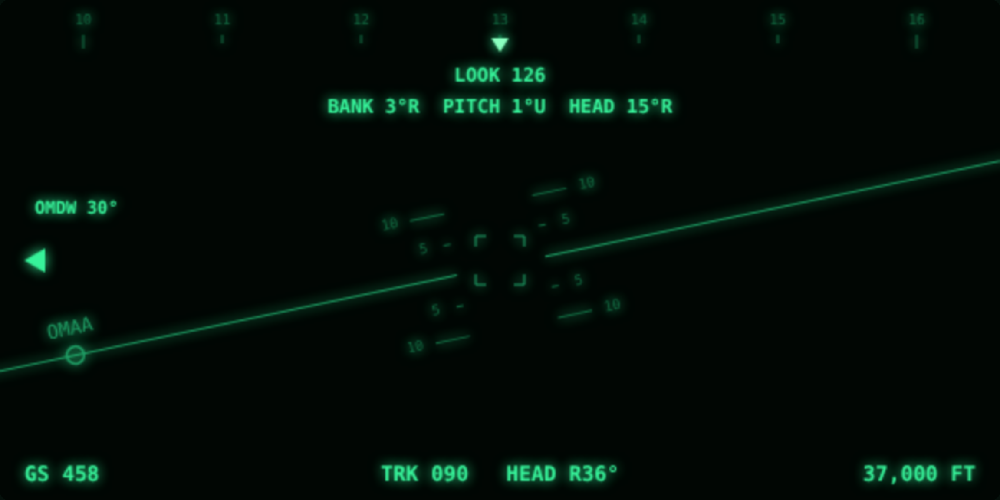
</p>

Honest caveats (the horizon here is *simulated* attitude standing in for the phone):

- **Coordinated-turn error.** An accelerometer can't separate gravity from
  acceleration, so a naïve phone-AHRS re-levels to the false vertical in a
  sustained turn. The fix is **GPS-aided correction** (subtract the centripetal
  term using the GLO's turn rate) — `coordinatedBankDeg()` in `core/attitude.ts`
  is that geometry. Imperfect in turbulence / unusual attitudes.
- **Mounting alignment.** The cradle sits at an arbitrary angle, so it needs a
  one-time **"straight-and-level, tap to zero"** leveling to learn the
  phone→airframe offset.
- **Heading is the weak axis.** Gyro yaw drifts and the cockpit magnetometer is
  unreliable; pitch/roll are solid, heading comes from GPS ground track.
- **Gating unknown.** Whether the Even WebView can read the phone's motion
  sensors (SDK phone-attitude API, or browser `DeviceMotion` with iOS
  permission) must be verified on hardware before relying on this.

Nothing here is an attitude *instrument* — it is an advisory reference for the
study-aid framing; the aircraft's ADIRS is always the reference.

---

## Test it on your iPhone — no glasses

### ▶ Live: **https://g2-aviation-hud.vercel.app**

Open that on your iPhone (**landscape**), tap **START**, and **Allow** Location +
Motion. "Add to Home Screen" for a full-screen app. It ships **~4,970 real ICAO
airports** and pulls **live METAR/TAF** (and **D-ATIS** for US fields) on demand.

The phone already has the sensors that matter — GPS and the same IMU that would be
the aircraft-attitude source — and it's a screen. So the whole HUD runs on the
phone in the browser, fed by **real** `navigator.geolocation` + `DeviceOrientation`.
This is the doc's "P1 — make it live" step: real data, real interaction, zero
hardware. To run/host it yourself: `npm run dev:mobile` (local) or
`npm run build:mobile` → deploy `dist-mobile/` + the `api/` functions to Vercel.

<p align="center">
  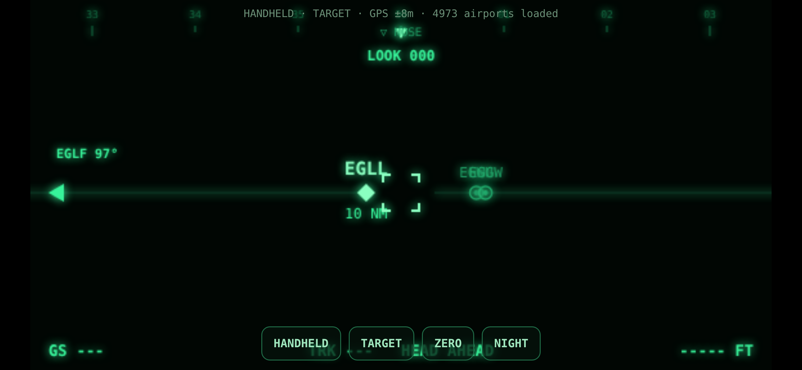
  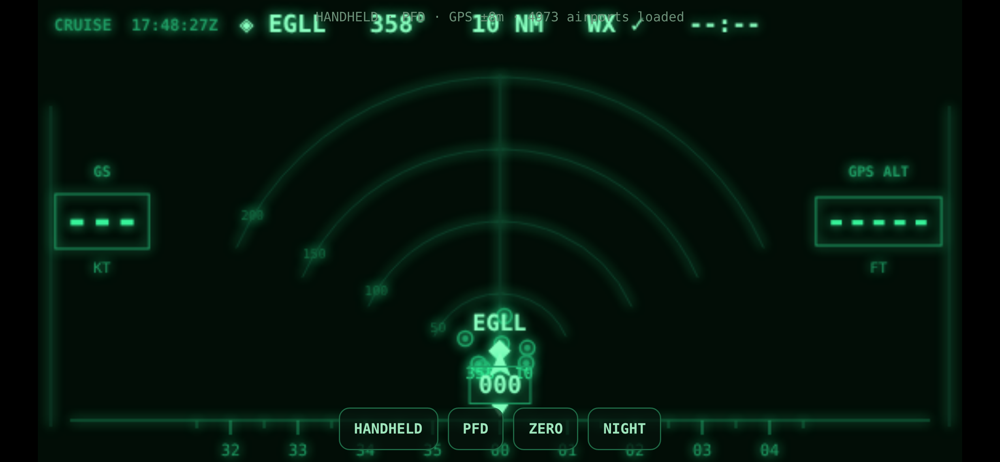
</p>

- **HANDHELD** — hold the phone up and **pan it around**; nearby airports appear
  at their real bearing; **tap the screen** to lock the field under the reticle.
- **MOUNTED** — cradle it on the glareshield for the PFD / diversion / attitude
  picture; `ZERO` levels the attitude reference.

### Running it (the one catch is HTTPS)

iOS only gives a web page GPS + motion over **HTTPS** (or `localhost`). Pick one:

**A — host it (simplest, stable URL).** Build the static bundle and drop it on any
HTTPS host (Vercel, Netlify, GitHub Pages):

```bash
npm install
npm run build:mobile      # → dist-mobile/  (static; deploy this folder)
```

**B — laptop + a quick tunnel.** Serve locally and expose it over HTTPS:

```bash
npm run dev:mobile                              # serves on http://localhost:5174
npx cloudflared tunnel --url http://localhost:5174   # prints an https URL
# open that https URL on the iPhone
```

Then on the iPhone: open the URL, rotate to **landscape**, tap **START**, and
**Allow** Location + Motion. "Add to Home Screen" gives a full-screen, chrome-less
app. A window/dashboard seat helps the GPS (and the Garmin GLO, once you pair it,
feeds this same GPS path).

> The mobile MVP treats every nearby field as "suitable" (no live weather yet) and
> has no runway/approach detail — it validates position, bearing, and the whole
> interaction. Live METAR/TAF and the attitude fusion are the next steps.

---

## Validated in the official EvenHub simulator

The **glasses build** (`src/glasses/`) renders through the real Even Hub SDK
(text containers), and is validated against the **official
`@evenrealities/evenhub-simulator`** — which rasterises the actual 576×288
glasses framebuffer with the real firmware font. These are real captures from it:

<p align="center">
  
  
</p>

Run it (on a machine with a display):

```bash
npm run dev:glasses      # serves http://localhost:5175
npx @evenrealities/evenhub-simulator http://localhost:5175
```

It can also run **headless** (the simulator has an automation HTTP API): with
`xvfb` + `libwebkit2gtk-4.1` installed, `scripts/sim-shot.sh out.png [action]`
boots the sim against the glasses build and captures the glasses framebuffer.
This immediately caught two real firmware discrepancies the canvas preview
missed: the **8-text-container-per-page limit**, and the firmware font's lack of
`✓`/`✗` glyphs. Both fixed.

### Graphical HUD on the glasses (image containers)

The **target-acquisition view** is free-form graphics, so on the glasses it
renders as **image containers**, not text. Using the simulator as an oracle, the
pixel format was confirmed to be a **base64-encoded PNG** (the firmware maps its
luminance to the 16-level green display; black = unlit). Since image containers
cap at 288×144, the 576×288 display is covered by a **2×2 grid of four PNG tiles**
(`src/bridge/image-display.ts`), re-pushing only tiles that changed. These are
real captures from the official simulator of the graphical build
(`src/glasses-gfx/`, `npm run dev:glasses-gfx`):

<p align="center">
  
  
  
</p>

So the signature interaction — sweep, acquire, lock, read the field's info —
now runs on the actual glasses framebuffer (attitude horizon, azimuth tape,
off-screen cues, reticle, and the lock card with runway + live-style METAR).

---

## The platform, in one paragraph

A G2 "app" is a **web app** loaded into a WebView on the paired iPhone; the
**display and input are relayed over Bluetooth LE** to the glasses. Each lens is
a **576 × 288, 16-level monochrome-green** micro-LED panel. Practical refresh is
low (a few FPS, one send at a time, limited BLE bandwidth), and the SDK renders
**≤ 12 absolutely-positioned containers** (text / list / image) rather than a
DOM — with no font-size control. Those constraints make a **sparse,
slow-changing, high-contrast** data strip the right design, which is exactly
what a glanceable cruise HUD wants. Positioning, IMU, gestures, and device
status come through the SDK's [`EvenAppBridge`](https://hub.evenrealities.com/docs/build/device-apis);
the Garmin GLO feeds `onAppLocationChanged` transparently as an iOS MFi
location source.

## What it shows — PFD layout

| Region | Content |
| --- | --- |
| **Left** | `GS` ground speed (kt), boxed |
| **Right** | `GPS ALT` geometric GPS altitude (ft), boxed |
| **Bottom** | Track/heading tape with the current ground track boxed under the lubber |
| **Top** | Best-divert callout: `◈ IDENT · bearing · distance · WX · ETE` |
| **Centre** | Track-up **diversion plan**: forward range fan (50/100/150/200 NM), ownship, and alternates plotted by bearing & distance |

### Diversion plan — state without colour

The G2 is monochrome green (no amber), so alternate status is carried by
**brightness and fill**, never colour:

- **Best alternate** — bright filled **◆ diamond** + ident + bearing/distance (nearest suitable field).
- **Other suitable fields** — dim ring with a filled centre dot.
- **Not suitable** (weather/NOTAM) — dim **hollow** ring.

"Suitability" is currently a stub flag on the demo alternates; a later iteration
sources it from live weather (METAR/TAF, e.g. over Starlink).

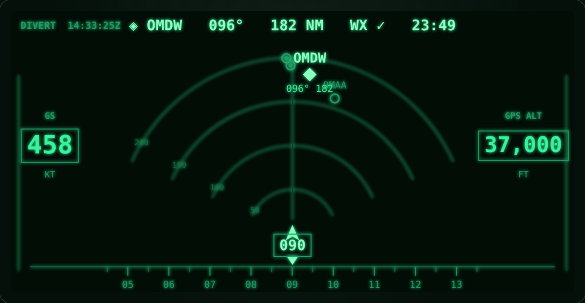

### Controls (simulator)

| Key | Action |
| --- | --- |
| `N` | Toggle night / day palette |
| `T` | Toggle CRUISE / DIVERT mode |
| `[` / `]` | Slow down / speed up the simulated flight |

On hardware these map to the temple touchpad / R1 ring gestures (press, double-press, swipe).

## Run the simulator (no hardware needed)

```bash
npm install
npm run dev        # opens the in-browser simulator
```

The simulator renders a faithful 576 × 288 monochrome-green display and **flies
a demo route** (`OTHH → OMDB`, Gulf corridor) so every field is live, with UAE
alternates in the forward fan. Controls are in the table above (`N` / `T` / `[` `]`).

Other scripts:

```bash
npm test           # nav-math unit tests (geo / time / flight plan / route parser)
npm run typecheck  # TypeScript, incl. the on-device SDK path
npm run build      # typecheck + build the simulator bundle
```

## Architecture

Pure, unit-tested nav math at the core; a canvas PFD renderer for the display;
and a **`GlassesBridge`** seam for the on-device text/input path.

```
src/
  core/    pure, unit-tested nav math & models (no SDK / DOM)
    geo.ts        great-circle bearing, distance, cross-track, along-track
    units.ts      m/s↔kt, m↔ft, glanceable formatting
    time.ts       UTC clock, ETE, ETA
    flightplan.ts Route + active-leg tracking → Guidance
    diversion.ts  rank suitable alternates by bearing / distance / ETE
  data/
    navdata.ts        bundled airports + demo route + demo alternates (not for nav)
    route-parser.ts   "OTHH DCT GLF01 … OMDB" → waypoints
    position/         PositionSource: SDK (Garmin GLO) + simulated flight
  hud/
    pfd.ts        the PFD renderer (speed L · alt R · track tape · diversion plan)
    model.ts / views.ts / renderer.ts   text-container views + diff (device path)
  bridge/
    bridge.ts     GlassesBridge interface (display + input)
    even-sdk.ts   real bridge over @evenrealities/even_hub_sdk
    sim-bridge.ts canvas text-container bridge
  app/controller.ts  state machine for the text/container path + gestures
  main.ts       on-device entry (WebView)
  sim/          browser dev harness — renders pfd.ts from live simulated data
```

Data flow (simulator): **PositionSource** (Garmin GLO / simulated) →
**computeAlternates()** + **FlightPlan** → **PfdState** → **drawPfd()** → canvas.

## Rendering on hardware

The G2 SDK renders **≤ 12 absolutely-positioned containers** (text / list /
image), not arbitrary graphics. The PFD therefore maps to:

- **Text containers** for the numeric readouts — `GS`, `GPS ALT`, the track-tape
  string, and the top callout. Cheap and updated without flicker.
- **One image container** for the centre diversion plan (arcs, ownship,
  alternates), rendered off-screen to a 4-bit-green bitmap and pushed via
  `updateImageRawData`. Image containers are ≤ 288 × 144, so the plan occupies
  the centre while text frames it.

This image path is **BLE-bandwidth limited** (a few FPS) — fine for a
slow-changing cruise/diversion picture, but it is why a live raster *moving map*
is out of scope.

## Device-honest preview (`H` / `B` / `M`)

The default simulator view is *idealised* (2× smoothed, glowing). Press **`H`** to
switch to a **device-honest** render — native 576×288, quantised to 16 green
levels, no glow — and **`B`** to composite it **additively over a bright daytime
scene**, emulating the see-through display (black = transparent; only lit green
adds light). This is the real test the doc's P0 gate asks for.

The lesson is stark. The full PFD, over a bright sky, largely washes out —
faint arcs and small labels disappear, and only bold marks over the dark
glareshield stay legible:

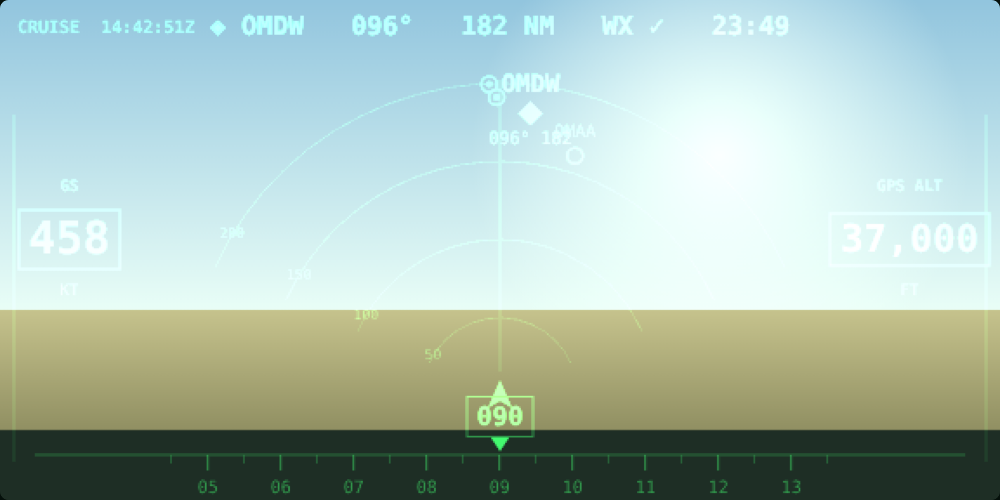

Press **`M`** for the **minimal** design — one salient answer, mostly black.
It stays out of the forward view and puts the persistent readouts low, over the
dark cockpit, where they hold contrast:

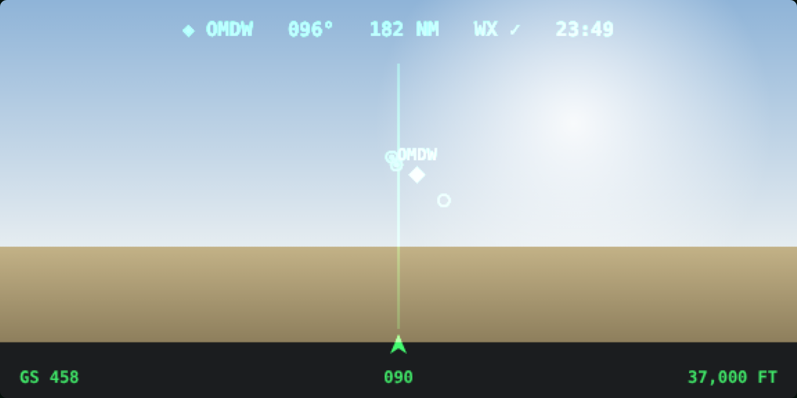

Design rules this preview forces:

- **Mostly black.** Every lit pixel is light thrown into the pilot's eyes — spend them sparingly.
- **Bold, few levels.** Thin 1-px lines and faint greys vanish; the 16-level ramp is coarse.
- **Place persistent info low**, over the dark glareshield, not high over the sky.
- **No smooth motion.** A few FPS over BLE — marks step, they don't glide.

The minimal variant is the direction; the full PFD remains as a richer option
for a brighter/darker phase or a higher-fidelity display adapter (iPad, Vision Pro).

## On-device deployment (roadmap)

Running on hardware requires the Even iPhone app, a paired G2, and a Garmin GLO,
so it can't be exercised in this repo's CI. Remaining device work: the PFD
image-container push, app icon + manifest, and submission via `even-publisher`.

## Roadmap

- PFD image-container rendering on hardware (centre plan) + BLE update tuning.
- Live weather for alternate suitability (METAR/TAF, e.g. over Starlink).
- Selectable plan range; declutter rules for closely-spaced fields.
- Pilot-entered / imported route (SimBrief or filed plan), persisted via SDK storage.
- Wind estimate from GS/track history; Top-of-Descent cue.
- IMU "look-down" declutter (dim the HUD when the pilot looks at the panel).

## Notes on the demo data

`src/data/navdata.ts` contains a handful of real airport reference points and a
few **synthetic** enroute fixes (`GLF01–03`) used only by the demo route. It is
**not** a navigation database and must not be used for real navigation.
